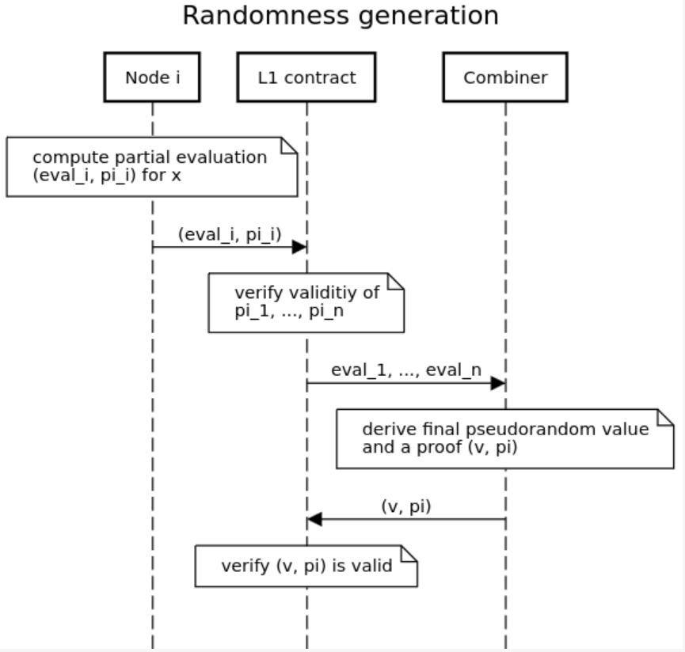

# zkDVRF

zkDVRF is a t-out-of-n threshold scheme that runs among a group of n distributed nodes. The protocol consists of two components: 
a snark-based non-interactive distributed key generation (NI-DKG) and randomness generation based on threshold bls-signatures.

Before the protocol starts, each node $i$ pre-generates its member public key $mpk_i$ and secret key $msk_i$ for encryption and decryption in NI-DKG protocol.

The two components proceed as follows: 
* NI-DKG:
  * Each node $i$ selects a random polynomial to create its public parameters $pp_i$ 
  and a SNARK proof $zkp_i$ to ensure the parameters are generated correctly. $(pp_i, zkp_i)$ is published somewhere, e.g., in L1 contract. 
  $pp_i$ also includes some secret shares generated for other nodes. These shares are encrypted using the corresponding recipient nodes' member public keys.
  * Once all the nodes publish their public parameters and SNARK proofs, $(pp_1, zkp_1, \cdots, pp_n, zkp_n)$, the public can verify all the SNARK proofs and determines a set of valid public parameters. 
  Then the public computes the global public key $gpk$ and all the nodes' verification keys $(vk_1, \cdots, vk_n)$.
  * Each node $i$ retrieves the public parameters and the corresponding SNARK proofs that other nodes created, $(pp_1, zkp_1, \cdots, pp_n, zkp_n)$. 
  From these data, node $i$ decrypts with its member secret key $msk_i$ to derive its own secret key $sk_i$ and all the nodes' verification keys $vk_1, \cdots, vk_n$.

     

* Randomness generation: given a public string $x$, nodes jointly generate a pseudorandom value,
  * Each node $i$ computes a partial evaluation $eval_i$ and a proof $\pi_i$, and publish $(eval_i, \pi_i)$ somewhere, e.g., L1 contract. The validity of $\pi_i$ can be checked against node $i$'s verification key $vk_i$.
  * Once there are $t$ valid partial evaluations, a combiner can combine these partial evaluations into the final pseudorandom value and generates a proof to show the value is correct. 
  The combination process can be performed by any party and it doesn't involve any secret information. To save the onchain verification cost, the combination can be done offchain and 
  only the final pseudorandom value and its proof needs to be verified onchain.

    

